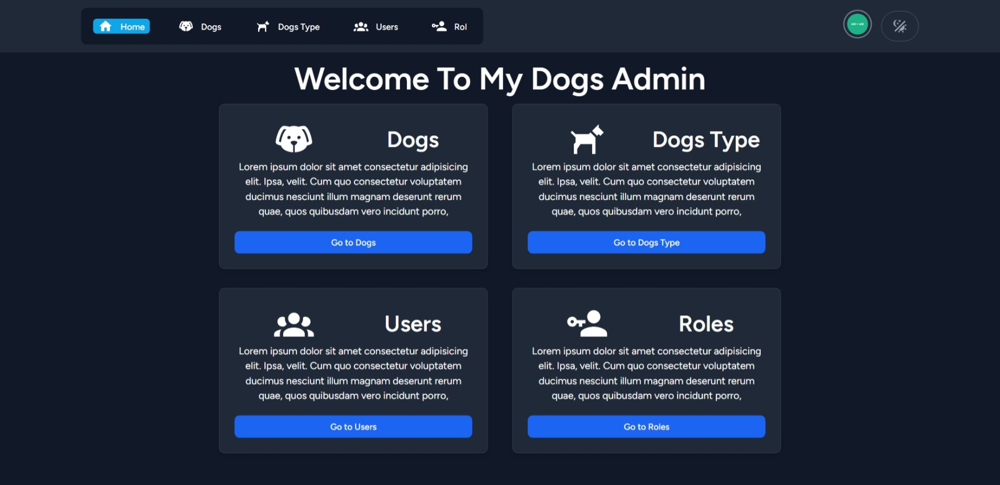
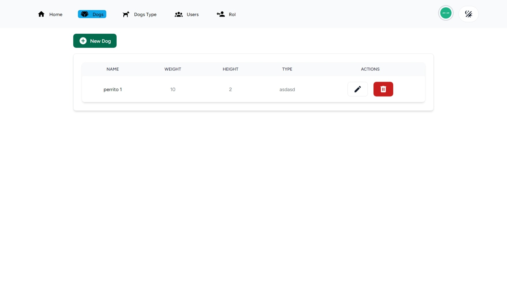
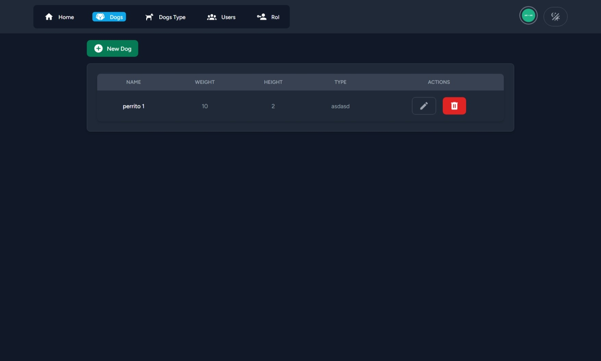

# My Dogs Admin


Manage informations about your dogs, fast and simple in one site.




## Table of contents

- [About the project](#about-the-project)
- [Install](#install)
    - [Requirements](#requirements)
    - [Steps](#steps)
- [Contribution](#contribution)

## About the project

A simple panel to manage information about your dogs, made using Laravel, vue and inertia.

## Install

### Requirements
- PHP 8.2
- MySQL
- Composer

## Steps

1. Clone the repo in your machine
2. Install the dependencies with the next command

```bash
composer install
```

3. Copy the `.env.example` file and rename it to `.env`
4. Run the migrations

```bash
# Remember to create the database before running this
php artisan migrate
```

5. Install the js dependencies
```bash
npm install
```

6. Run the server
```bash
npm run dev
```

7. Go to your localhost, you should see the app running
